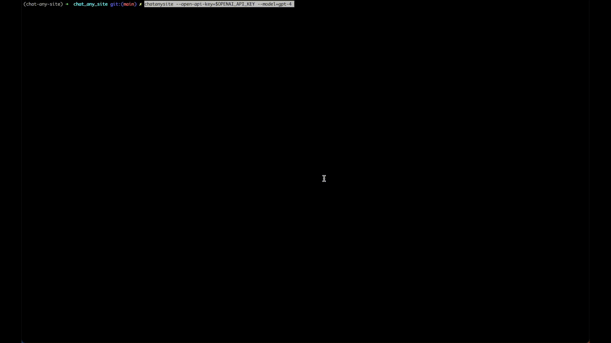

# Chat-Any-Site

## Description

A small Python project to ask a chatbot questions about any website (with a sitemap), using an LLM service and local vector store.

This uses OpenAI models (so you must have API access) and Chroma (an in-memory vector store) to store the embeddings of the site data locally.

## Motivation

1. A good excuse to play with LangChain
2. OpenAI models, like GPT-4, we're only trained up until Sep 2021. So, if you ask if question about anything more recent, it won't have a clue. This project let's you do exactly that.
3. Publicly available models were only trained on public data. I want a chat bot that can answer questions about sensitive or private data. This can do exactly that. For example, by passing in the sitemap of a private wiki, like Confluence.

## Before You Begin

Make sure you have an [OpenAI API Key](https://help.openai.com/en/articles/4936850-where-do-i-find-my-secret-api-key)

**Respect any wesbite's robot.txt and ai.txt. In fact, maybe just only use this on websites that you own.**

## Setup and Installation

This project was developed using Python 3.10

Follow these steps to install and run the project:

1. Clone the repository:
```commandline
git clone https://github.com/mkwatson/chat_any_site.git
```

2. Change into the project directory:
```commandline
cd chat_any_site
```

3. Create a virtual environment and activate it (optional, but recommended):
```commandline
python3.10 -m venv env
source env/bin/activate  # On Windows, use `env\Scripts\activate`
```

4. Install the project dependencies:
```commandline
pip install .
```

## Usage

To run the command-line interface, execute the script:

```commandline
chatanysite
```

There are two arguments you must pass:
1. OpenAI API Key (defaults to the `OPENAI_API_KEY` environment variable)
2. A valid sitemap.xml
3. OpenAI model you want to use

You can also pass some or all in like
```commandline
chatanysite \
  --open-api-key=<your openai api key> \
  --site=https://<host>/sitemap.xml \
  --model=gpt-4
```

## Demo

In this demo I'm passing along the sitemap to the [LangChain Documentation](https://python.langchain.com/en/latest/index.html).
LangChain was released on Oct 2022. I'm also using GPT-4, which was only trained on data up to Sep 2021. 
So, the model, as is, does not know about LangChain. Nevertheless, I'm able to get expert responses about LangChain.


[Higher quality YouTube version](https://youtu.be/vAWgbTUTuRc)

## Known Limitation

- Because the vector data is stored locally in-memory, it's only transient.
- It can take a long time to download all the pages listed in the sitemap.

## Next Steps

- [ ] Add the ability to store the vector data in a remote persistent data store
- [ ] Make a web client
- [ ] What if you made a Google user, and then if you added it as read-only to any Google Doc or file on Google drive it sucked it down and you could ask questions about it?
- [ ] Probably at least one test